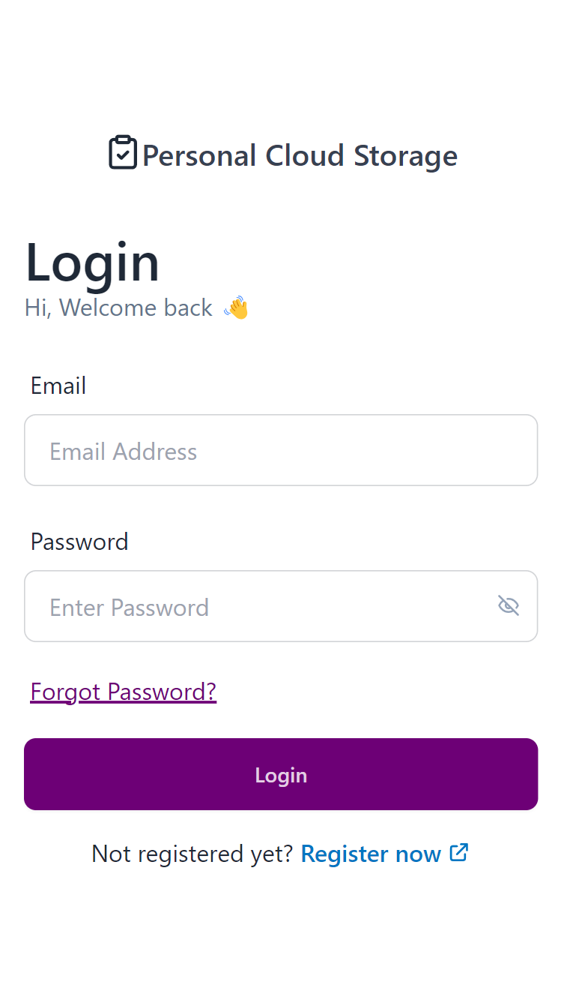
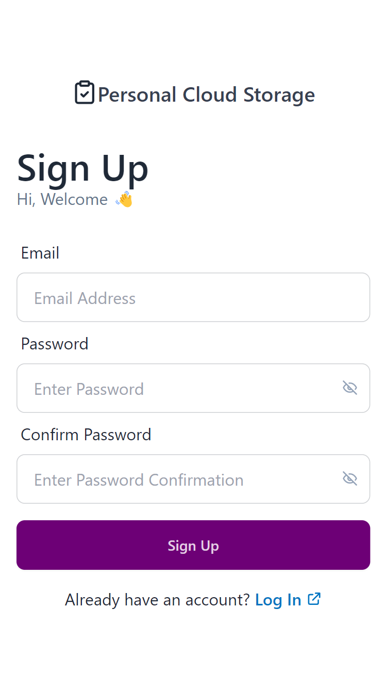
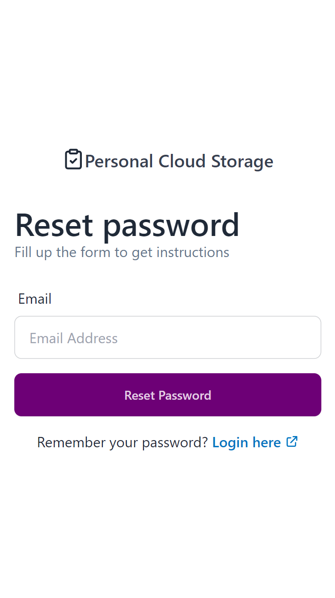
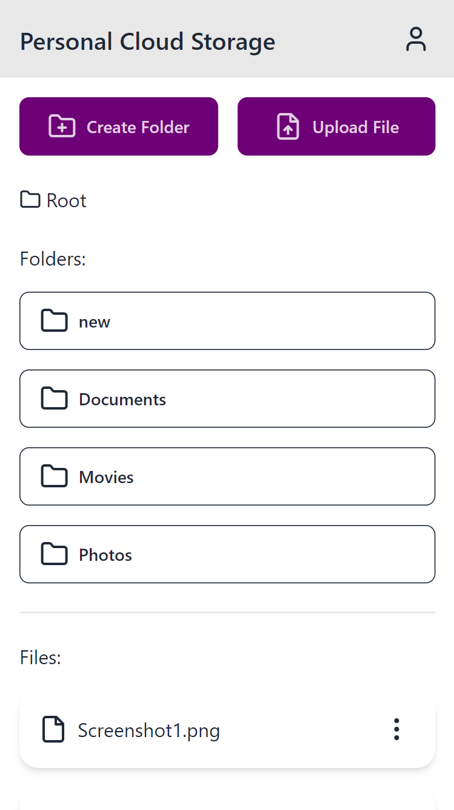
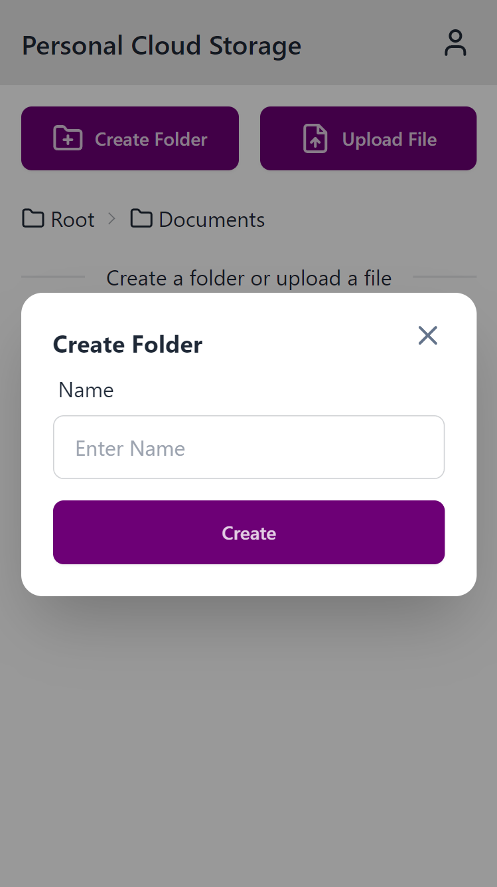

# Personal Cloud Storage

PersonalCloudStorage – a web application enabling users to securely create accounts and store
files in a cloud-based storage system.

## Tech Stack

JavaScript, React.js, Firebase Auth, Firebase Database, Firebase Storage, Tailwind CSS, DaisyUI

## Screenshots

  
  
  

  
  
  

<!-- Commit on 2024-01-01T17:26:00 -->
<!-- Commit on 2024-02-07T16:08:00 -->
<!-- Commit on 2024-03-15T10:31:00 -->
